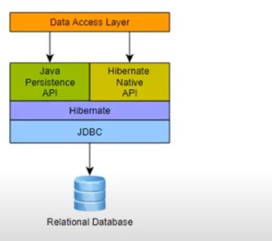
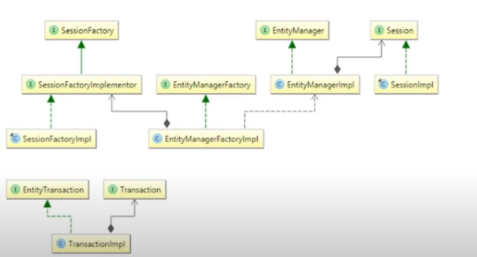

# Overview

---

+ `Hibernate` is an `Object/Relational Mapping` solution for Java environments.
+ The term `Object/Relational Mapping` refers to the technique of mapping data from an object model representation to a relational data model representation(and vice versa).
+ `Hibernate` not only takes care of the mapping from java classes to database table(and from data types to `SQL` types), but also provides data query and retrieval facilities.
+ `Hibernate's` design goal is to relieve the developer from 95% of common data persistence-related programming tasks by eliminating the need fro manual, hand-crafted data processing using `SQL` and `JBDC`.
+ `Hibernate` does not hide the power of `SQL` from you and guarantees that your investment in relational technology ia as valid as always.
+ `Hibernate` may not be the best solution for data-centric applications that only used stored-procedures to implement the business  logic in the database.
+ `Hibernate` can certainly help you to remove or encapsulate vendor-specific `SQL` code and will help the common task of result set translation from a tabular representations to a graph of objects.

# System Requirements

+ Hibernate 5.2 and later versions require at least `Java 1.8` and `JDBC 4.2`.

# Architecture

 

+ As a `JPA` provider, `Hibernate` implements the `Java Persistance API` specifications and the associations between `JPA interfaces and Hibernate` specific implementations can be visualized in the following diagram :

# Hibernate Components

+ `SessionFactory (org.hibernate.SessionFactory)`
    + A thread-safe (and immutable) representation of the mapping of the application domain model to a database. Acts as a factory for `org.hibernate.session`.
      + The `EntityManagerFactory` is the `JPA` equivalent of a `SessionFactory` and basically those two converge into the same `SessionFactory` implementation.
      + A `SessionFactory` is very expensive to create, so, for any given database, the application should have only one associated `SessionFactory`. The `SessionFactory` maintains services that `Hibernate` across all Session(s) such as second level `caches, connection pools, transaction system integrations, etc`. 
      
+ `Session (org.hibernate.Session)`
    + A single-threaded,short-level object in `JPA` nomenclature, the `Session` is represented by an `EntityManager`. 
    + Behind the scenes, the `Hibernate Session` wraps a `JDBC java.sql.Connection` and acts as a factory for `org.hibernate`. `Transaction` instances. It maintains a generally "repeatable read" persistence context (first level cache) of the application domain model.
  
+ `Transaction (org.hibernate.Transaction)`

    + A single-threaded, short-lived object used by the application to demarcate individual physical transaction boundaries.
    + `EntityTransaction` is the `JPA` equivalent and both act as an abstraction `API` to isolate the application from the underlying transaction system in use `(JDBC or JTA)`.
  
    

+ ``

